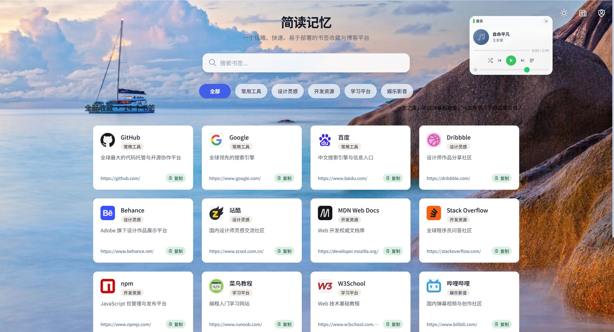
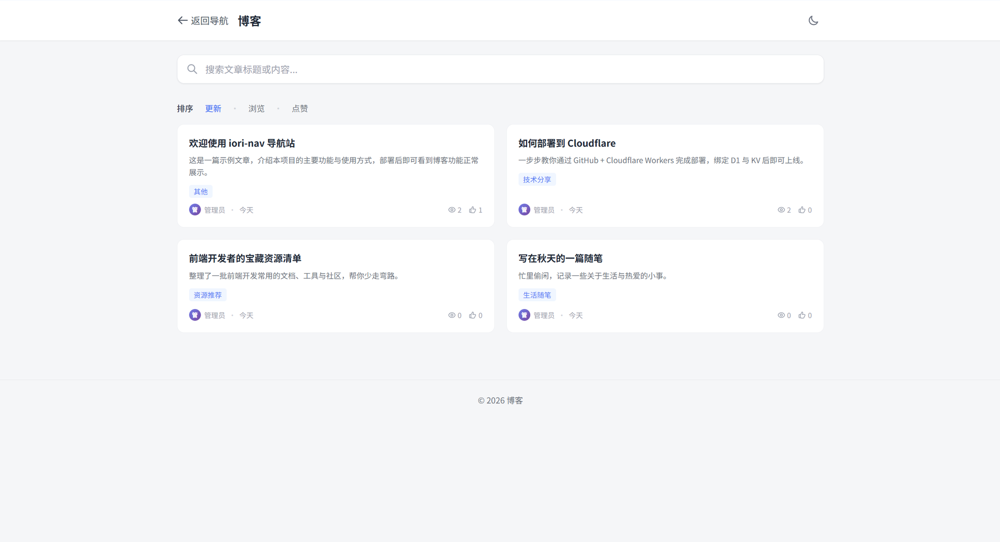

# iori-nav · 网址导航 + 博客 + 音乐 导航站

<p align="center">
  一个优雅、快速、易于部署的书签（网址）收藏与分享平台，内置 <strong>博客</strong> 与 <strong>音乐播放器</strong>，完全基于 Cloudflare 全家桶构建（Workers + D1 + KV）。
</p>

> 🔧 **本项目由原版 [iori-nav](https://github.com/jy02739244/iori-nav) 二次开发**。在保留原版书签导航核心能力的基础上，新增了**博客**（Markdown 写作、四个固定分类、阅读统计）与**音乐播放器**（自定义歌单）两大功能，并内置示例数据、完善后台管理与部署体验，详见下文功能说明与更新日志。

<p align="center">
  <a href="https://github.com/ajie4979/My-Nav/stargazers"></a>
  <a href="https://github.com/ajie4979/My-Nav/network/members"></a>
  <a href="https://github.com/ajie4979/My-Nav/blob/main/LICENSE"></a>
  <a href="https://github.com/ajie4979/My-Nav/issues"></a>
</p>

<p align="center">
  <a href="#-核心特性">特性</a> •
  <a href="#-示例数据">示例数据</a> •
  <a href="#-快速部署">快速部署</a> •
  <a href="#-本地开发">本地开发</a> •
  <a href="#-环境变量说明">变量说明</a> •
  <a href="#-常见部署问题">常见问题</a> •
  <a href="#-技术栈">技术栈</a> •
  <a href="#-更新日志">更新日志</a>
</p>

---

## ✨ 核心特性

| 特性 | 说明 |
| :--- | :--- |
| 📚 **书签导航** | 多级分类管理常用网站，支持站内搜索、快捷复制、私密收藏 |
| ✍️ **博客** | 支持 Markdown 写作、四个固定分类（技术分享 / 生活随笔 / 资源推荐 / 其他）、阅读统计、排序切换 |
| 🎵 **音乐播放器** | 首页右上角（主题切换按钮左侧）迷你播放器，支持歌单管理、播放/暂停/上一首/下一首、进度与音量控制 |
| 🎨 **主题定制** | 支持自定义壁纸、卡片风格、毛玻璃、圆角、主色调与夜间模式 |
| 🔍 **快速搜索** | 内置站内模糊搜索，迅速定位所需网站 |
| 🔒 **安全后台** | 基于 KV 的管理员认证，提供书签 / 博客 / 音乐完整增删改查后台 |
| 📝 **用户提交** | 支持访客提交书签，经管理员审核后显示（可通过环境变量关闭） |
| ⚡ **性能卓越** | 利用 Cloudflare 边缘缓存，秒级加载，节省 D1 数据库读取成本 |
| 📤 **数据管理** | 支持书签数据的导入与导出，兼容 Chrome 导出的 HTML 格式，也可从公共书签库一键导入 |

---

## 🖼️ 效果预览

| 首页（书签导航，右上角为音乐播放器） | 博客列表 |
| :---: | :---: |
|  |  |

---

## 🧪 示例数据

> 部署后**首次访问**（空数据库）系统会自动写入一批示例数据，让你第一时间确认各项功能正常：

- 📚 **书签**：5 个分类（常用工具 / 设计灵感 / 开发资源 / 学习平台 / 娱乐影音）+ 14 个常用网站
- ✍️ **博客**：4 篇示例文章（覆盖四个固定分类，Markdown 正文）
- 🎵 **音乐**：3 首示例音乐（SoundHelix 免费音频，可直接播放）

示例数据随时可以在后台**编辑或删除**，不影响正常使用。系统通过 KV 标记 `demo_seeded_v1` 保证只插入一次，不会覆盖你已有数据。

---

## 🚀 快速部署

> **准备工作**：你需要一个 [Cloudflare](https://dash.cloudflare.com/) 账号（免费即可），本机安装 **Node.js 18+**，并把本仓库代码下载到本地。

### 方式一：Cloudflare Workers（推荐，本项目默认方式）

#### 步骤 1：获取代码并安装依赖

```bash
git clone <你的仓库地址>      # 或直接下载并解压本项目压缩包
cd iori-nav

# 安装依赖
npm install

# wrangler.toml 已内置 [[d1_databases]] / [[kv_namespaces]] 段，
# 但资源 ID 用 ${D1_DATABASE_ID} / ${KV_NAMESPACE_ID} 占位（避免公开仓库泄露个人 ID）。
# 本地部署二选一：
#   A. 设置环境变量 D1_DATABASE_ID / KV_NAMESPACE_ID（推荐，见下方步骤 3/4）
#   B. 直接把 wrangler.toml 里的两个占位符替换成你的真实 ID（⚠️ 含个人 ID 后不要提交到公开仓库）
```

#### 步骤 2：登录 Cloudflare

```bash
npx wrangler login
```

浏览器会弹出 Cloudflare 授权页面，登录你的账号并点击「允许」授权（首次需要）。出现 `Successfully logged in` 即成功。

#### 步骤 3：创建 D1 数据库

1. Cloudflare 控制台 → `存储和数据库` → `D1 SQL 数据库` → `创建数据库`
2. 数据库名称输入 `book`（可自定义），创建完成后复制 **database_id**
3. 配置 ID（二选一）：
   - 设置环境变量：`$env:D1_DATABASE_ID="你的database_id"`（PowerShell）/ `export D1_DATABASE_ID=你的database_id`（bash）
   - 或直接打开 `wrangler.toml`，把 `${D1_DATABASE_ID}` 替换为你的真实 ID

#### 步骤 4：创建 KV 命名空间并配置后台登录凭据

1. Cloudflare 控制台 → `存储和数据库` → `Worker KV` → `创建命名空间`
2. 名称输入 `NAV_AUTH`，创建完成后复制 **id**
3. 配置 ID（二选一）：
   - 设置环境变量：`$env:KV_NAMESPACE_ID="你的id"`（PowerShell）/ `export KV_NAMESPACE_ID=你的id`（bash）
   - 或直接打开 `wrangler.toml`，把 `${KV_NAMESPACE_ID}` 替换为你的真实 ID
4. 进入该 KV 命名空间 → `查看键` → `添加键值`，配置后台登录凭据（两个条目）：
   - 键 `admin_username`，值：你的管理员用户名（如 `admin`）
   - 键 `admin_password`，值：你的管理员密码（建议设置强密码）

#### 步骤 5：编译 Functions（关键步骤）

本项目采用 Worker 入口（`main = ".wrangler/worker-build/index.js"`），`functions/` 目录下的所有路由代码（后台、博客、音乐等）必须**先编译成 worker 包**，否则相关页面/接口不会生效：

```bash
# （可选）若修改过 public/css/tailwind.css，先重建样式
npm run build:css

# 编译 Pages Functions，生成 .wrangler/worker-build/index.js
npx wrangler pages functions build functions --outdir .wrangler/worker-build
```

> ⚠️ **每次修改 `functions/` 下的代码后，都必须重新执行上面的编译命令再部署**，否则改动不会上线（这是最常见的"改了没生效"的原因）。

#### 步骤 6：部署

```bash
npx wrangler deploy
```

部署成功后你会得到类似 `https://my-navp.你的账号.workers.dev` 的访问地址。

> ⚠️ **重要**：`wrangler.toml` 中 `[assets]` 必须配置 `run_worker_first = true`。
> 否则 Cloudflare 的静态资产会**优先于 Worker** 返回 `index.html` 模板，首页会显示 `{{SITE_NAME}}`、`{{SITES_GRID}}` 等原始占位符（后端渲染不生效）。

#### 步骤 7：部署后验证

1. 打开你的部署地址，首页应正常显示站点名称与书签导航
2. **首次访问会触发数据库初始化**：自动建表并写入示例数据（书签 / 博客 / 音乐），可先到前台确认各项功能正常
3. 访问 `https://你的域名/admin`，用步骤 4 配置的 `admin_username` / `admin_password` 登录后台
4. 后台可管理书签、分类、博客文章、音乐歌单与首页设置

### 方式二：Cloudflare 网页部署（Git 集成，全自动，无需本地命令行）

> 适合不想在本地敲命令的用户：代码已推送到 GitHub 后，全程在 Cloudflare 网页上操作，构建与部署由 Cloudflare 云端自动完成。（新版 Cloudflare 已将 Workers 与 Pages 合并统一，以下步骤按新版界面撰写。）
>
> ⚠️ **顺序很重要**：必须**先**建好 D1/KV 资源并复制其 ID，**再**连接 Git 创建项目——因为创建项目时就要在「高级设置」里填入这两个 ID，这样第一次部署即带绑定、一次成功，无需先失败一次再补。

**第一步：创建 D1 数据库（先做，拿到 ID）**

控制台 → `存储和数据库` → `D1 SQL 数据库` → `创建数据库`，名称填 `book`，创建后在数据库详情页复制 **database_id**（形如 `xxxxxxxx-xxxx-xxxx-xxxx-xxxxxxxxxxxx`），先保存到记事本。

**第二步：创建 KV 命名空间并配置后台登录凭据（先做，拿到 ID）**

1. 控制台 → `存储和数据库` → `Workers KV` → `创建命名空间`，名称填 `NAV_AUTH`，创建后复制其 **id**（一长串十六进制字符），同样保存
2. 进入该命名空间 → `查看键` / `记录` → `添加记录`，依次添加两条：
   - 键 `admin_username`，值：你的管理员用户名（如 `admin`）
   - 键 `admin_password`，值：你的管理员密码（建议强密码）

**第三步：连接 GitHub 创建项目并填写构建变量（核心）**

1. 控制台 → `Workers 和 Pages` → `创建` → 点 **Continue with GitHub（连接到 Git）**→ 授权后选中本仓库（如 `My-Nav`）→ `开始设置 / 下一步`
2. 在「设置您的应用程序」页填写：
   - **项目名称**：`my-nav`（必须与仓库 `wrangler.toml` 中 `name = "my-nav"` 一致，决定默认域名 `my-nav.你的账号.workers.dev`）
   - **构建命令**：`npm run build`（Cloudflare 会自动识别 `package.json` 的 build 脚本；若没自动填就手动填。该脚本自动完成「注入绑定 ID + 样式编译 + functions 编译」，**不能省略或只填 build:css**，否则后台/博客/音乐接口不生效）
   - **部署命令**：`npx wrangler deploy`（保持默认）
   - **Protect with Cloudflare Access：不要勾选**（勾选后所有访客需登录，公开站点勿开）
3. **点开页面下方的「高级设置」**，向下滚过「非生产分支部署命令 / 路径 / API 令牌」，找到 **变量名称 / 变量值 / 加密** 区域，添加两个变量（**均不要勾选「加密」**，保持明文）：
   - 第一行：变量名称 `D1_DATABASE_ID`，变量值填第一步复制的 D1 database_id
   - 点该行右下的 **「+ 添加变量」**，第二行：变量名称 `KV_NAMESPACE_ID`，变量值填第二步复制的 KV id
   - 💡 构建时 `scripts/inject-bindings.mjs` 会自动把这两个 ID 注入 `wrangler.toml`，部署后即生成 `NAV_DB` / `NAV_AUTH` 绑定，**无需再去「绑定」页手动添加，以后推送代码也不会丢失绑定**
4. 确认无误后点右下蓝色 **「部署」**

**第四步：验证**

1. 部署完成后进入项目 → `部署 / Builds`，点开本次构建日志，看到下面两行即代表绑定成功：
   - `[inject-bindings] D1_DATABASE_ID 已注入`、`[inject-bindings] KV_NAMESPACE_ID 已注入`
   - `env.NAV_DB (book) D1 Database`、`env.NAV_AUTH (xxxxxxxx) KV Namespace`
2. 访问 `https://my-nav.你的账号.workers.dev`，首页正常显示、首次访问自动写入示例数据（书签/博客/音乐）
3. 访问 `/admin`，用第二步设置的 `admin_username` / `admin_password` 登录后台

> 📌 **如果创建项目时漏填了构建变量（或删除重建了项目）**：不必重新走创建流程，进入已有 Worker 项目 → `设置（Settings）` → `构建（Build）` → `构建变量和机密`，补填上面两个变量并保存，再到 `部署 / Builds` 对失败的那次点 **「重试 / Retry」** 即可（重试会读取最新构建配置，无需重新推代码）。

> 💡 **注意**：本项目的默认/主推部署方式是上方「方式一 Cloudflare Workers」。方式二为网页全自动部署（Git 集成），适合不想碰命令行的用户；项目的 `functions/` 与 `public/` 已按 Cloudflare 标准组织，云端会自动处理。若遇到问题建议回到方式一。

---

## 🧪 本地开发

> 本地开发依赖 `wrangler.toml`。仓库已提交一份**共享版 `wrangler.toml`**（含 main/assets/站点配置/绑定段，但 D1/KV 资源 ID 用 `${D1_DATABASE_ID}` / `${KV_NAMESPACE_ID}` 占位）。本地开发时设置这两个环境变量，或直接把占位符替换成你的真实 ID（**不要提交含真实 ID 的 `wrangler.toml` 到公开仓库**）：

```bash
npm install
# PowerShell：
$env:D1_DATABASE_ID="你的D1_ID"; $env:KV_NAMESPACE_ID="你的KV_ID"
# bash：
export D1_DATABASE_ID=你的D1_ID KV_NAMESPACE_ID=你的KV_ID

npm run dev        # 启动本地开发服务器
```

---

## 🔑 环境变量说明

### 1) 必需绑定

| 绑定名 | 类型 | 说明 |
| :--- | :--- | :--- |
| `NAV_DB` | D1 | 主数据库绑定（必需） |
| `NAV_AUTH` | KV | 会话、限流、缓存标记、后台凭据存储（必需） |

### 2) 条件绑定

| 绑定名 | 类型 | 说明 |
| :--- | :--- | :--- |
| `AI` | Workers AI | 使用 Cloudflare Workers AI 生成描述时必需 |

### 3) 可选变量

| 变量名 | 默认值 | 说明 |
| :--- | :--- | :--- |
| `ENABLE_PUBLIC_SUBMISSION` | `false` | 是否允许访客投稿 |
| `SITE_NAME` | `简读记忆` | 首页站点名称（环境变量兜底） |
| `SITE_DESCRIPTION` | `一个优雅、快速、易于部署的书签...` | 首页副标题（环境变量兜底） |
| `FOOTER_TEXT` | `曾梦想仗剑走天涯` | 首页页脚文案 |
| `ICON_API` | `https://faviconsnap.com/api/favicon?url=` | 自动补全 logo 的接口前缀 |
| `AI_REQUEST_DELAY` | `1500` | AI 一键补全描述调用间隔（毫秒） |
| `WORKERS_AI_MODEL` | `@cf/google/gemma-4-26b-a4b-it` | Workers AI 模型兜底 |
| `TURNSTILE_SITE_KEY` | 空 | Cloudflare Turnstile 站点密钥 |
| `TURNSTILE_SECRET_KEY` | 空 | Cloudflare Turnstile 机密密钥 |

> 配置优先级：首页名称/副标题等支持后台设置项的字段，优先读取数据库 `settings`，环境变量作为兜底。

### 🔐 管理后台

> 后台管理页面地址：`https://你的域名/admin`

- **文章管理**：`/admin/posts`（新建 / 编辑 / 发布 / 删除博客文章，可选四个固定分类）
- **音乐管理**：`/admin/musics`（新增 / 编辑 / 删除音乐，支持直接填音频 URL）
- **设置**：`/admin`（首页布局、卡片风格、壁纸、AI 等）

后台登录凭据存放在 `NAV_AUTH` KV 的 `admin_username` 与 `admin_password` 两个键内。登录后返回 **HttpOnly 会话 Cookie**（默认 1 天，可选 1/7/30/60/90 天）。

---

## 📦 数据导入与导出

后台点击 **导入** 后，可选择 **上传文件** 或 **公共书签库** 两种来源，进入预览页勾选书签、选择目标分类后写入数据库。

- **Chrome 书签 HTML**：浏览器「书签管理器 -> 导出书签」得到的文件
- **JSON**：与导出功能产出的结构一致，形如 `{ "category": [...], "sites": [...] }`

> 公共书签库仓库：<https://github.com/jy02739244/bookmark-library>

---

## ❗ 常见部署问题

- **首页显示 `{{SITE_NAME}}`、`{{SITES_GRID}}` 等模板占位符**：`wrangler.toml` 的 `[assets]` 缺少 `run_worker_first = true`。静态资产优先于 Worker 导致后端渲染未执行，加上后重新部署即可。
- **`/admin` 无法登录或反复跳回登录页**：确认已绑定 `NAV_AUTH`，并在该 KV 中创建 `admin_username`、`admin_password`。
- **首页 500 或数据为空**：确认 `NAV_DB` 已正确绑定到 `book` 数据库；首次部署后访问一次首页触发建表与示例数据初始化。
- **博客 / 音乐 API 返回 500**：多为旧版本数据库缺少新表字段，重新部署后系统会自动补齐（`schema-migration` 会自动 ALTER 补全 posts / musics 字段）。
- **前台看不到投稿入口**：确认 `ENABLE_PUBLIC_SUBMISSION=true`。
- **修改了 `public/css/tailwind.css` 但样式未生效**：先执行 `npm run build:css` 再重新部署（网页 Git 部署的 `npm run build` 已自动包含此步）。
- **部署报 `KV namespace '${KV_NAMESPACE_ID}' is not valid` 或绑定为空**：没有配置构建变量。方式二请到 `设置 → 构建 → 构建变量和机密` 添加 `D1_DATABASE_ID`、`KV_NAMESPACE_ID`（值为你自己的资源 ID），再重新部署。
- **每次推送代码后 D1/KV 绑定就丢失**：`wrangler deploy` 会用 `wrangler.toml` 覆盖网页上手动添加的绑定。本项目已通过「构建变量 + `scripts/inject-bindings.mjs`」解决——不要在「绑定」页手动添加，改为在「构建变量」里填 ID，绑定会在每次部署时自动生成且不丢失。
- **部署报 `entry-point file .wrangler/worker-build/index.js was not found`**：构建命令缺少 functions 编译。方式二确保构建命令为 `npm run build`（不要只用 `npm run build:css`）；方式一先执行 `npx wrangler pages functions build functions --outdir .wrangler/worker-build`。

---

## 🔧 技术栈

| 类别 | 技术 |
| :--- | :--- |
| **计算** | [Cloudflare Workers](https://workers.cloudflare.com/)（functions 后端 + 静态资源） |
| **数据库** | [Cloudflare D1](https://developers.cloudflare.com/d1/)（SQLite） |
| **存储** | [Cloudflare KV](https://developers.cloudflare.com/workers/runtime-apis/kv/) |
| **前端** | 原生 HTML + [TailwindCSS](https://tailwindcss.com/) |

---

## 📋 更新日志

<!-- changelog:start -->
- 📦 **2026-08-28**：本项目为原版 [iori-nav](https://github.com/jy02739244/iori-nav) 的二次开发版本
- ✍️ **2026-08-28**：内置示例数据（书签 / 博客 / 音乐），部署后首次访问自动初始化
- 📄 **2026-08-28**：新增博客功能（Markdown 写作、四个固定分类、阅读统计、排序）
- 🎵 **2026-08-28**：新增音乐播放器（首页右上角，支持歌单管理）
- 🐞 **2026-08-28**：修复 Worker Assets 模式下首页显示模板占位符的问题（`run_worker_first = true`）
- 🐞 **2026-08-28**：修复旧库升级时 posts / musics 表缺字段导致的 500（自动 ALTER 补全）
- 📚 以上为本次二次开发新增/修复内容，其余历史更新见下方
<!-- changelog:end -->

---

## 📄 许可证

本项目采用 [MIT](LICENSE) 许可证。

<p align="center">如果你喜欢这个项目，请给它一个 ⭐️！</p>
